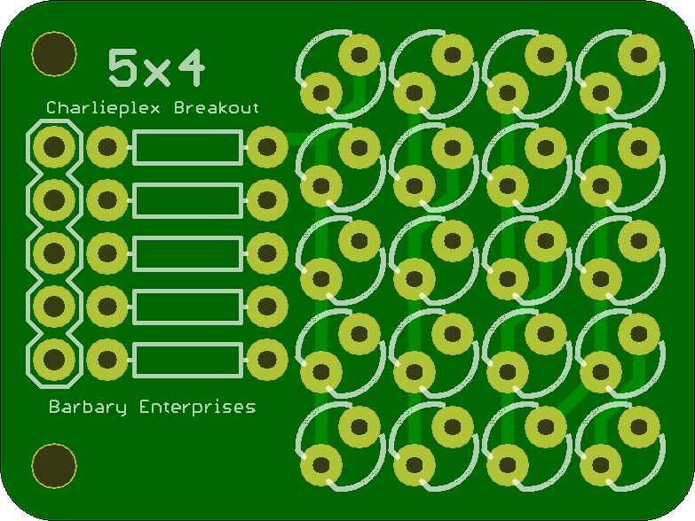
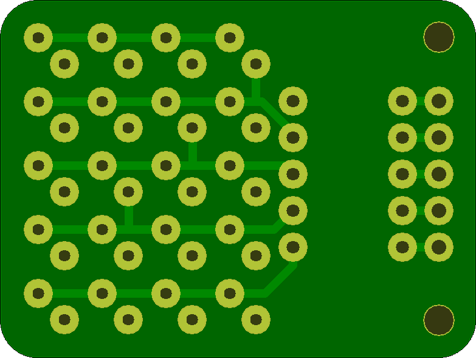
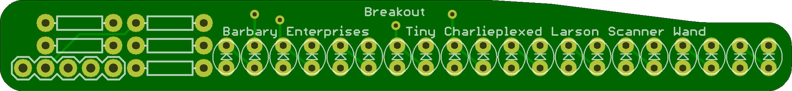
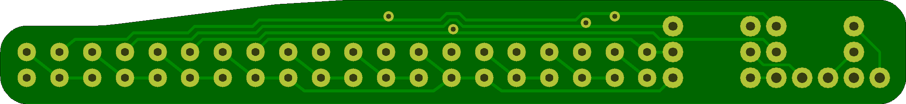
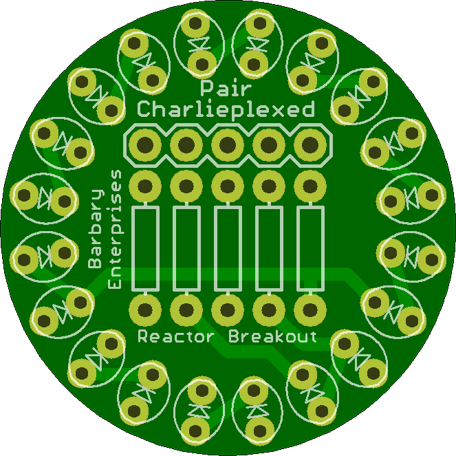
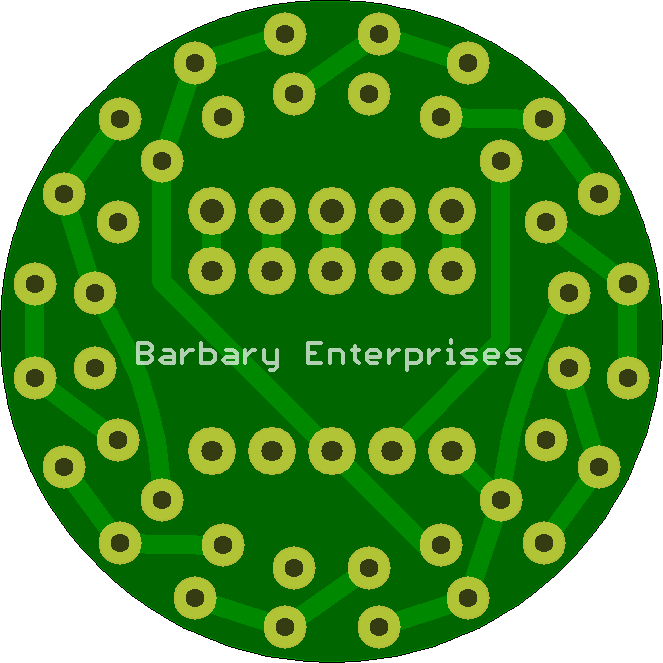
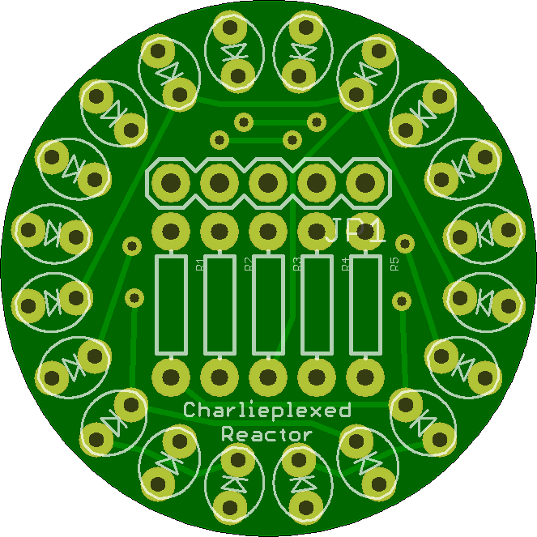
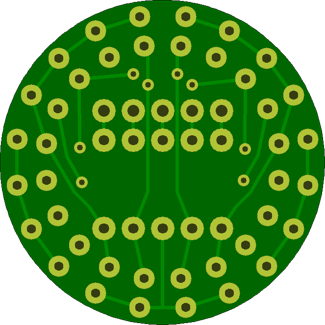
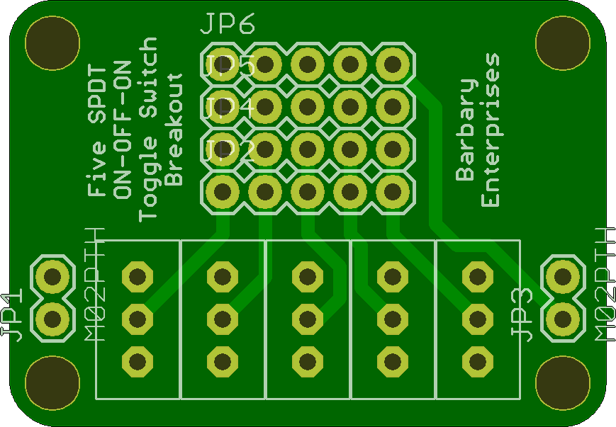

## Charlieplex Demo Breakout Boards

This set of breakouts can be used to demonstrate how a charlieplex functions. 

The Five Toggle breakout board uses on-off-on single pole, double through toggle switches. This gives each of the five output pins possible values of HIGH, LOW, and INPUT or High Impedance. 

This can then be used to demonstrate how this works with the different layouts of charlieplexed LED's.

## CharlieBreakout 

### Board dimensions

* (130000, 97500) original units
* (1.3000, 0.9750) inches
* (33.0200, 24.7650) mm

[gerbers](CharlieBreakout_gerber.zip?raw=true)

| Front | Back |
| --- | --- |
|  |  |

## CharlieplexedLarsonScannerWandBreakout 

### Board dimensions

* (350000, 40000) original units
* (3.5000, 0.4000) inches
* (88.9000, 10.1600) mm

[gerbers](CharlieplexedLarsonScannerWandBreakout_gerber.zip?raw=true)

| Front | Back |
| --- | --- |
|  |  |

## CharlieplexedPairReactorBreakout 

### Board dimensions

* (110000, 110000) original units
* (1.1000, 1.1000) inches
* (27.9400, 27.9400) mm

[gerbers](CharlieplexedPairReactorBreakout_gerber.zip?raw=true)

| Front | Back |
| --- | --- |
|  |  |

## CharlieReactorBreakout 

### Board dimensions

* (110000, 110000) original units
* (1.1000, 1.1000) inches
* (27.9400, 27.9400) mm

[gerbers](CharlieReactorBreakout_gerber.zip?raw=true)

| Front | Back |
| --- | --- |
|  |  |

## FiveToggleBreakout 

### Board dimensions

* (140001, 99993) original units
* (1.4000, 0.9999) inches
* (35.5603, 25.3982) mm

[gerbers](FiveToggleBreakout_gerber.zip?raw=true)

| Front | Back |
| --- | --- |
|  |  |

